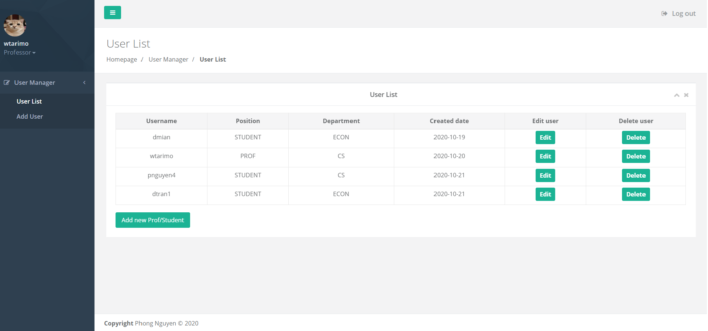

# CNN WEB APP

A simple webapp designed to support College Management


## Requirements:
Please ensure that you have the below items to start the application:
- Java Developement Kit 8 or later (Java Runtime Environement included). You can download from Oracle's website: https://www.oracle.com/java/technologies/javase/javase-jdk8-downloads.html
- IDE (Highly recommened): IntelliJ, Apache Netbeans, Eclipse IDE, etc
## Dependencies:
Please ensure that you have the below dependencies to start the application:
* [Spring Boot](https://projects.spring.io/spring-boot/)
* [Spring Data JPA](https://projects.spring.io/spring-data-jpa/) (data access)
* [Spring Security](https://projects.spring.io/spring-security/) (web security)
* [Thymeleaf](http://www.thymeleaf.org/) (template engine)
* [thymeleaf-extras-springsecurity4](https://github.com/thymeleaf/thymeleaf-extras-springsecurity) (security in template)
* [MySQL](https://www.mysql.com/) (database)

## Installation:
```
$ git clone https://github.com/meobilivang/CnnWebapp.git
```
## Compile and Run:
There are ways to build and run this Spring Boot application.
1. Using IDE: 
    
    1. Click 'Run'
2. Using Terminal:
    1. Navigate to the directory of your project
       ```
       $ cd ~/the-directory-storing-the-project
       ```
    2. Run the project: 
        1. Use Maven command:
            ```
            $ mvn spring-boot:run
            ```
        2. Run :
        
            ```
            $ java -jar path/to/your/jarfile.jar fully.qualified.package.Application 
            ```

### NOTE:
Follow this path to the core of this web app: 
    **~/src/main/java/com/pdnguyen/cnnwebapp/**
The HTML, JS, CSS files are the template which i used for client interface, can use Postman for testing.
## Test accounts:
- Professor: 
    + wtarimo - 123 
- Student:
    + pnguyen4 - 123
